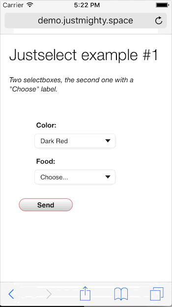

# Justselect - Input select lightweight styling library

## What is it?

Creating custom-styled select boxes was always painful. Pure CSS cannot do this and many of JavaScript libraries which can are so messy, big and contain some unnecessary things. We just wanted to get some clear and lightweight solution.

### Example




## How to use it?

### Basic usage

```html
<link rel="stylesheet" href="css/selectbox.css">
<script type="text/javascript" src="js/selectbox.js"></script>
```

Add the _justselect_ class to all `<select>` elements, which you want to style:

```html
<select class="justselect">
```

**That's all**, the Justselect library will do the rest for you! That sounds great, isn't that?


### Adding a label

If you want to have a _Choose_ label in a selectbox, create an `<option>` with _disabled_ and _selected_ property in it, like this:

```html
<option disabled selected>Choose...</option>
```
